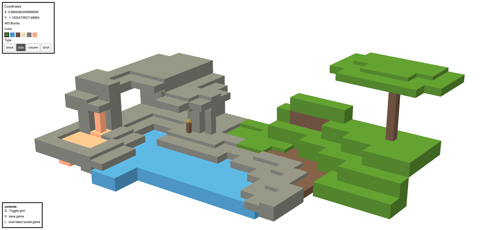

# box
Hi, after using Three.js for a few weeks at work, I thought it was about time to do a side project.

This game is very inspired by [Minecraft](//minecraft.net), and the [Three.js Voxelpainter example](https://threejs.org/examples/?q=voxel#webgl_interactive_voxelpainter).



## How to play

*   Pan the camera by holding left click and moving the mouse
*   zoom out and in using your scroll wheel
*   place blocks by right clicking, and left to remove

Enjoy!

## Project setup
```
yarn install
```

### Compiles and hot-reloads for development
```
yarn run serve
```

### Compiles and minifies for production
```
yarn run build
```

### Run your tests
```
yarn run test
```

### Lints and fixes files
```
yarn run lint
```

### Customize configuration
See [Configuration Reference](https://cli.vuejs.org/config/).
